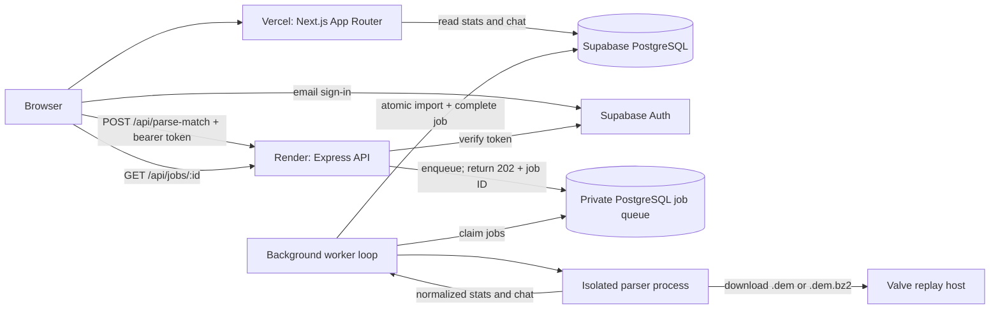

# CS2 Tracker: architecture and setup

## 1. Architecture



**Vercel never downloads or parses demos.** Its server work consists of bounded database reads and optional Steam vanity URL resolution. The browser calls the persistent backend directly. No Vercel function stays open while waiting for an import.

The backend hosts an HTTP server and a configurable number of asynchronous worker loops (default **one**). Each job's download, decompression, and native parsing execute in a separate child process, so CPU work cannot block Express. PostgreSQL stores the queue; Redis is unnecessary for this initial architecture.

Jobs move through `queued → running → completed`, or retry and eventually become `failed`. Workers claim rows atomically with `FOR UPDATE SKIP LOCKED`. A 20-minute lease recovers interrupted jobs; a fresh token prevents an old worker from saving after reassignment. Each attempt has a 10-minute process deadline. A job gets at most three attempts, with 30 seconds between failures. Failed final attempts require operator intervention or an updated replay URL.

Match, player, and chat records are saved in one transaction, together with job completion. An error rolls back the whole import. Duplicate submissions of the same canonical URL reuse the existing job for its owner; another submitter receives 409. Different URLs for the same demo are not deduplicated by content. Never use a submitted player ID as the match ID or as the source of parsed player stats.

### Parser clarification

The requested **`@opensafe/demofile` could not be found on public npm** (registry returned 404). Do not put an invented version or API into production. The runnable scaffold substitutes **`@laihoe/demoparser2@0.42.0`**, whose upstream project explicitly supports CS2 and Node.js. See [the upstream installation/API examples](https://github.com/LaihoE/demoparser) and [scoreboard example](https://github.com/LaihoE/demoparser/blob/main/examples/scoreboard/index.js).

`backend/src/parser.ts` is the adapter boundary. It reads the map from `parseHeader`, final recorded round stats using `parseEvent("round_end")` plus `parseTicks`, and messages from the parser's `chat_message` event (`user_steamid`, `user_name`, `tick`, `chat_message`). Steam IDs remain strings throughout. Bots are excluded. Output is validated before database writes.

If you have a private source for `@opensafe/demofile`, verify its CS2 support, installation/authentication requirements, and actual event API, then replace this adapter while preserving `ParsedDemo`. The generic `demofile` npm package is a CS:GO parser; substituting it would not satisfy this CS2 app.

### Scope and data semantics

- A Steam ID does **not** directly provide a replay URL. This version accepts an existing Valve URL. Automatic match discovery needs a separate share-code/Steam Game Coordinator integration and suitable user authorization; that integration is not included.
- Stats are the scoreboard at the last recorded round end. A partial demo can contain only part of a match. K/D is kills divided by deaths; headshot percentage is headshot kills divided by kills. Zero denominators display a dash.
- Dashboards aggregate the latest 100 imported matches and display the latest 200 messages **sent by that player**. Import timestamps are not match timestamps.
- Chat can only be extracted if it was recorded in the demo. Team chat, voice chat, or deleted messages cannot be reconstructed. The current parser event does not expose a reliable channel field, so none is invented.
- Match/stat/chat tables are deliberately publicly readable. Job URLs and submitter IDs are in a private schema. For a private tracker, replace the public read policies and implement authenticated dashboard reads before launch.

## 2. Folder structures

The two folders have independent manifests and lockfiles, with no imports across their boundary. They can be connected to different GitHub repositories.

```text
cs2-tracker-web/                 # contents of frontend/
├── app/
│   ├── layout.tsx              # shared navigation and styling
│   ├── page.tsx                # /: Steam URL/ID search
│   ├── actions.ts              # validates search; optional vanity lookup
│   ├── login/page.tsx          # email magic-link sign-in
│   └── players/[steamId]/page.tsx
├── components/
│   ├── search-form.tsx
│   └── parse-form.tsx          # submit + authenticated job polling
├── lib/                       # Steam input, Supabase reads/browser auth
├── tests/steam.test.ts
├── next.config.ts             # short profile redirect
├── .env.example
├── package.json
└── package-lock.json

cs2-tracker-api/                 # contents of backend/
├── src/
│   ├── server.ts              # startup, Supabase auth, shutdown
│   ├── app.ts                 # Express routes, CORS, quotas
│   ├── store.ts               # durable queue and atomic writes
│   ├── worker.ts              # concurrency, leases, child process timeout
│   ├── job-runner.ts          # child process entry point
│   ├── download.ts            # streamed download, bzip2, size limits
│   ├── demo-url.ts            # host/path and public-IP validation
│   ├── parser.ts              # CS2 parser adapter
│   ├── model.ts               # normalized/validated parser output
│   ├── database.ts
│   └── config.ts
├── db/001_initial.sql
├── tests/pipeline.test.ts
├── Dockerfile
├── render.yaml
├── .env.example
├── package.json
└── package-lock.json
```

## 3. Supabase setup

1. Create a Supabase project near your backend region. Save its project URL and publishable key (or legacy anon key).
2. Run `backend/db/001_initial.sql` once in the Supabase SQL editor as the project database owner. It is a versioned migration, not a repeatable seed script. It creates three public tables, private jobs, indexes, grants, and row-level read policies.
3. Under Auth settings, disable new user signups for this initial invite-only importer. Invite your own email in the user-management screen. The frontend also passes `shouldCreateUser: false`.
4. Set the Auth Site URL to the final Vercel domain. Add exact redirect URLs `https://YOUR-DOMAIN/login` and, for development, `http://localhost:3000/login`. Configure production SMTP/email delivery before inviting real users.
5. Copy the PostgreSQL connection string from **Connect**. Prefer the direct connection when the host supports its network family, otherwise use the **Supavisor session pooler**, normally port 5432. Passwords containing special characters must be URI-encoded. This is a persistent worker; [Supabase explains direct and pooler choices here](https://supabase.com/docs/guides/database/connecting-to-postgres).
6. Keep TLS certificate verification enabled. If the endpoint uses a Supabase-specific CA, download the project's CA from Supabase and mount it on the backend. Set `DATABASE_CA_PATH` to its file path. Do not use `rejectUnauthorized: false`. The backend strips URI SSL overrides and configures verified TLS explicitly.

The initial backend uses the project database owner's connection to run private queue queries and writes. This is a server-only credential. For a larger deployment, provision a restricted writer role with access to only these schemas/tables. Public/publishable keys cannot write any of the three public tables; the private schema is inaccessible to anon/authenticated roles. See [Supabase RLS documentation](https://supabase.com/docs/guides/database/postgres/row-level-security).

## 4. Configuration

### Vercel / frontend

| Variable | Purpose |
| --- | --- |
| `NEXT_PUBLIC_SUPABASE_URL` | Supabase project URL |
| `NEXT_PUBLIC_SUPABASE_ANON_KEY` | Publishable or legacy anon key; protected by database RLS |
| `NEXT_PUBLIC_API_URL` | HTTPS Render service origin, e.g. `https://cs2-tracker-api.onrender.com` |
| `STEAM_WEB_API_KEY` | Optional server-only key for `/id/custom-name` profile URLs |

Do not put a database password or Supabase service-role key in any `NEXT_PUBLIC_*` variable. This frontend needs neither. Public variables are embedded at build time: redeploy after changing them.

Search supports SteamID64, `https://steamcommunity.com/profiles/<SteamID64>`, and custom `/id/<name>` profile URLs. Custom URLs require the optional Steam key. Without it, the page prompts for a numeric ID.

### Render / backend

| Variable | Purpose |
| --- | --- |
| `DATABASE_URL` | Secret Supabase direct/session PostgreSQL URI |
| `DATABASE_CA_PATH` | Optional path to the project's CA certificate file |
| `SUPABASE_URL` | Project URL used to verify bearer tokens |
| `SUPABASE_ANON_KEY` | Publishable/anon key; service-role key is unnecessary |
| `FRONTEND_ORIGIN` | Exact frontend origin, e.g. `https://YOUR-DOMAIN` |
| `PORT` | Listen port; default 3001, bind address `0.0.0.0` |
| `WORKER_CONCURRENCY` | 1 initially; supported range 1–4 |
| `TRUST_PROXY_HOPS` | 1 behind Render's proxy, 0 for direct local access; verify other hosts |

CORS is restricted to the configured origin. Authentication checks use Supabase `getUser(token)`, not unverified JWT decoding. Submission quotas are ten requests per user per hour per API process, plus a database-enforced cap of three active jobs per user. Before scaling to many replicas, move the hourly rate-limit store to shared storage and add a global capacity policy.

## 5. GitHub → Vercel

### Publish the frontend repository

Create an empty GitHub repository named `cs2-tracker-web`. Copy the **contents** of `frontend/` into a fresh local directory, excluding `node_modules`, `.next`, `.env.local`, and other build/private files. Include hidden files, the lockfile, and `next.config.ts`.

```bash
cd cs2-tracker-web
git init -b main
git add .
git commit -m "Set up CS2 Tracker frontend"
git remote add origin https://github.com/YOUR-ACCOUNT/cs2-tracker-web.git
git push -u origin main
```

### Connect Vercel

1. In Vercel, choose **Add New → Project**, authorize GitHub access, and import `cs2-tracker-web`.
2. Choose the Next.js preset. Root Directory: repository root. Node: 24.x. Install: `npm ci`; build: `npm run build`; retain Next.js's default output settings.
3. Add the frontend environment variables for the environments you use. The Render URL can be filled in once that service is created; redeploy afterward.
4. Deploy. Vercel will build new production deployments from your production branch and preview deployments for pull requests. Auth redirect/CORS settings must match any preview domain you intend to use with sign-in or imports.
5. Add your domain in the Vercel project settings and configure DNS using the exact values Vercel provides. Update Supabase redirect URLs and the backend's `FRONTEND_ORIGIN`.

### Short Steam URLs

The committed `next.config.ts` includes:

```ts
async redirects() {
  return [{
    source: "/:steamId(7656119[0-9]{10})",
    destination: "/players/:steamId",
    permanent: true,
  }];
}
```

On a domain attached to this Vercel project, `https://mystatssite.now/76561198000000001` redirects with HTTP 308 to `/players/76561198000000001`. Use your actual registered domain; this example does not create or reserve a hostname. The numeric pattern avoids capturing `/login`, `/api`, or Next.js assets.

A **redirect** changes the address bar. If you want the short URL to stay in the address bar, move the same mapping to `rewrites()` and remove `permanent`. Use one behavior, not both. No external proxy service or `vercel.json` is required. See [Next.js redirects](https://nextjs.org/docs/app/api-reference/config/next-config-js/redirects) and [rewrites](https://nextjs.org/docs/app/api-reference/config/next-config-js/rewrites).

## 6. GitHub → Render

1. Create `cs2-tracker-api` on GitHub. Copy the **contents** of `backend/` to its root, including `Dockerfile`, `render.yaml`, `.dockerignore`, `.gitignore`, `db/`, and the lockfile. Exclude `.env`, `node_modules`, `dist`, and demos. Initialize/commit/push as above, changing the repository name.
2. In Render, create a **Blueprint** from this repository; `render.yaml` declares a Docker web service and health check. Alternatively, create a **Web Service**, connect the GitHub repository, choose Docker, and set the Dockerfile path to `./Dockerfile`.
3. Use an **always-on paid service** with enough RAM for native parsing. The Blueprint starts with `standard`, concurrency one. Measure peak RSS with representative demos before choosing your final size; the 2 GiB expanded-file limit is not a RAM estimate. A sleeping free service cannot reliably process queued jobs continuously.
4. Set the backend variables from the table above. If required, add the Supabase CA as a Render secret file and set `DATABASE_CA_PATH=/etc/secrets/<filename>` in the dashboard. Apply the SQL migration before deploying.
5. Deploy. The Docker image compiles TypeScript, installs the native Linux parser, and includes `bzip2`. The final container runs as the unprivileged Node user. Render routes requests to the configured `PORT`; health check path is `/healthz`.
6. Confirm `https://YOUR-SERVICE.onrender.com/healthz` returns `{"status":"ok"}`. Startup and readiness check the database and private queue table.
7. Set Vercel's `NEXT_PUBLIC_API_URL` to that HTTPS origin and redeploy the frontend. Set `FRONTEND_ORIGIN` to the final Vercel/custom-domain origin and redeploy the backend.
8. New pushes to the connected production branch trigger deployments. On shutdown, the backend stops accepting connections, terminates active parser process groups, and requeues interrupted attempts. If it is killed abruptly, the lease recovers work after expiry.

Temporary files live in each parser job's OS temp directory and are removed after success/failure. Persistent disk is unnecessary because jobs and results live in PostgreSQL. Abrupt machine termination can leave temp files until the host replaces the ephemeral filesystem; monitor disk space for repeated native crashes or forced shutdowns.

The [Render Node/Express guide](https://render.com/docs/deploy-node-express-app) explains repository connection and web service deployment; this project uses Docker to include the native parsing/decompression dependencies.

**Railway alternative:** connect the same backend repository as a persistent Docker service, configure the same variables, generate its HTTPS domain, set `/healthz`, and keep the service running. Configure proxy trust for Railway's actual ingress. The application/queue design does not depend on Render-specific APIs.

### Keeping one GitHub repository instead

You can also deploy this combined repository twice: set Vercel's Root Directory to `frontend`, and the Render web service Root Directory to `backend` (Dockerfile `./Dockerfile`). The backend Blueprint is written for the standalone backend repository; if using a monorepo Blueprint, set its path/root/context appropriately or use the web service dashboard. No workspace package manager is needed.

## 7. API and verification

### Submit an import

The dashboard obtains the signed-in user's Supabase access token and sends:

```http
POST /api/parse-match
Authorization: Bearer <Supabase user access token>
Content-Type: application/json

{"demoUrl":"http://replay123.valve.net/730/REAL_REPLAY.dem.bz2"}
```

Response after the database enqueue commits (the example URL must be replaced with a real, unexpired URL):

```json
{"jobId":"<uuid>","status":"queued"}
```

HTTP status is **202**. `GET /api/jobs/<uuid>` with the same bearer token returns `status`, `attempts`, a safe error message, and `updated_at`. Another user cannot inspect that job. The dashboard polls every three seconds, stores the pending job ID locally, and refreshes server-rendered data on completion. A lost browser tab does not stop a queued import. A polling error can be retried with **Check status**; expired sessions need another sign-in.

The importer accepts only `http(s)://replay<number>.valve.net/730/<filename>.dem[.bz2]`, rejects redirects, checks resolved IPs at connection time, caps downloaded bytes at 512 MiB and decompressed bytes at 2 GiB, and checks the Source 2 demo signature. It intentionally rejects unsupported replay hosts; add a verified host rule if you need another Valve region, preserving SSRF protections.

### Checks to run before launch

1. In both app roots: `npm ci`, `npm run build`, `npm test`.
2. Visit `/`, search by SteamID64 and canonical profile URL; test a vanity URL with a configured Steam key.
3. Open `/<SteamID64>` and confirm its redirect to `/players/<SteamID64>`.
4. Sign in as an invited user, submit a current Valve demo URL, and observe queued/running/completed status without a long HTTP request.
5. Confirm stats and recorded chat appear on the parsed players' pages. Try a duplicate URL and an expired URL. While a job is running, verify `/healthz` remains responsive.
6. Restart the backend with queued/running work and verify durable recovery. Inspect logs using job IDs; do not log bearer tokens, connection strings, or replay URLs.

No real provider credentials, deployments, domains, or GitHub repositories are created by this scaffold. The sample URL is illustrative. Hosted email/auth, a live Valve download, real Supabase networking/TLS, and memory sizing must be verified against your own configured deployment.
